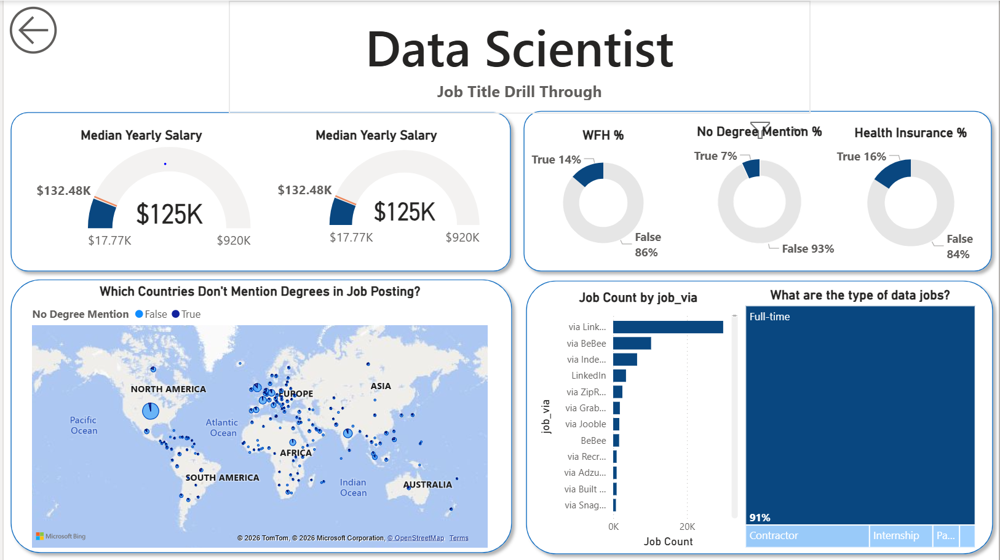

---

# **Data Jobs Dashboards with Power BI** 📊

## **Introduction**

The world of data science is evolving rapidly, and job seekers and job swappers alike are constantly looking for ways to better navigate this dynamic landscape. Whether you are just starting your career or are considering a career switch, it can be challenging to find clear, actionable insights into the growing data job market. This is especially true when dealing with an overwhelming amount of job postings, scattered across various platforms, with data such as titles, salaries, and locations buried in different corners of the web.

This dashboard is designed to help you, as a job seeker or job swapper, solve a common problem: **getting a comprehensive and visual understanding of the data job market**. Leveraging a dataset of **2024 Data Science Job Postings**, it provides a structured overview of key information such as job titles, salaries, locations, and skill requirements. This allows you to explore current market trends, compensation packages, and the demand for specific skills, all at a glance.

---

## **Features**

### 1. 🏷️ **Job Titles and Roles**

The dashboard highlights various data science roles available in the market in 2024. Whether you are interested in data analysis, machine learning, data engineering, or business intelligence, the dashboard categorizes the postings, making it easy for you to identify which roles are in demand and align your job search accordingly.

### 2. 💵 **Salaries and Compensation Analysis**

View the salary distribution across different data science roles and industries. Compare salaries based on job titles, locations, and even experience levels to get an accurate picture of compensation trends in the market. **Salary heatmaps** and **bar charts** visually represent how compensation varies, allowing you to make data-driven decisions.

### 3. 🌍 **Geographical Distribution**

Locations are key when considering a data job opportunity. The dashboard includes **Geo-Analysis** where you can explore job postings by city, region, or country. Whether you're open to relocating or prefer remote work, you can visualize the geographic concentration of jobs and opportunities in your preferred location.

### 4. 📈 **Market Trends and Skill Demand**

Based on the 2024 dataset, you can analyze which skills are most in demand by employers. This includes a focus on **Data Transformation**, **ETL Processes**, and **Power Query**, all of which are crucial for handling large datasets and ensuring high-quality, clean data for decision-making. Additionally, **Implicit Measures** and knowledge of **Core Charts** are shown as highly desirable competencies for various roles.

### 5. **Skills Showcased**

The dashboard highlights key skills that are most requested in job postings. Whether you are proficient in **Data Transformation**, **ETL**, or **Power Query**, these skills are emphasized and mapped against the job market. You’ll also see which roles specifically seek expertise in building **KPI Indicators**, designing **Interactive Dashboards**, and utilizing advanced features like **Slicers**, **Buttons**, and **Drill-Through Reporting** for enhanced user interactivity.

### 6. 🖥️ **Dashboard Design and UI**

Designed with ease of use in mind, the dashboard utilizes **clean UI design** principles, offering **interactive reporting**, including filters and slicers, to allow users to drill down into specific datasets and narrow their search criteria. You can effortlessly toggle between different job categories, locations, and salary ranges to explore data according to your needs.

### 7. 🔄 **Interactive Reporting and Features**

* **Slicers**: Customize your data views based on factors like experience level, location, or salary range.
* **Buttons**: Click-through navigation between various job categories and filters.
* **Drill-through**: Go deeper into specific data points such as salary trends or role requirements.

---
## Dashboard Overview
### Page-1 : High Level Market View

### Page-1 : Job Drill Through View

---
## 🚀 **Getting Started**

This dashboard uses **Power BI**, a powerful data visualization tool, to transform complex data into an easy-to-digest, interactive report. To get the most out of this dashboard, you should have a basic understanding of Power BI and its core features, including **Data Transformation** and **Power Query**. If you are new to these tools, plenty of resources are available online to get you up to speed.

1. **Import Data** 📥: The underlying dataset consists of job postings from various sources, aggregated to provide a comprehensive view of the data job market in 2024.
2. **Explore Data** 🔍: Use slicers and buttons to filter and explore job titles, salaries, locations, and skills.
3. **Analyze Trends** 📉: Visualize salary distribution, geographical trends, and skill demand.
4. **Leverage Insights** 💡: Use the insights to guide your job search, improve your resume with the most in-demand skills, and assess the competitive landscape.

---

## 🧠 **Key Skills Showcased**

* **Data Transformation & ETL**: Transform raw data into valuable insights using Power Query, ensuring clean and actionable datasets.
* **Implicit Measures**: Build complex calculations with implicit measures to derive meaningful KPIs and performance indicators.
* **Core Charts & Visualizations**: Present data using essential Power BI charts (bar, line, scatter) to communicate trends and key insights.
* **Geo-Analysis**: Visualize location-based trends and explore job postings in different regions using map visuals.
* **KPI Indicators**: Set clear, measurable targets and track your progress through KPI indicators.
* **Interactive Reporting**: Create dynamic dashboards with slicers, buttons, and drill-through capabilities for a more tailored experience.

---

## 🏁 **Conclusion**

Whether you are just starting out or looking to transition into a new data science role, the "Data Jobs Dashboards with Power BI" is designed to equip you with the knowledge and tools necessary to make data-driven career decisions. By analyzing the 2024 dataset, you can gain valuable insights into **market trends**, **salary expectations**, and **key skill sets**, all through a user-friendly, interactive dashboard.

With Power BI, transforming complex datasets into clear, actionable insights has never been easier. So dive in, explore the job market, and take control of your career path!

---

Feel free to customize the icons based on your platform's capabilities, but this layout should work well for visualizing the key sections with icons. Would you like me to suggest some specific icon sets or other customizations?

